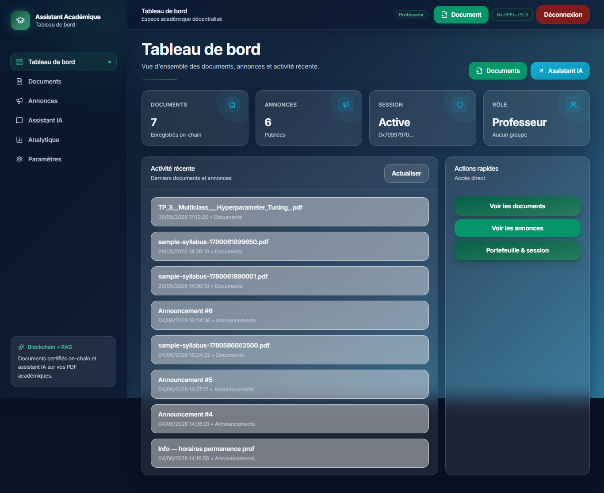
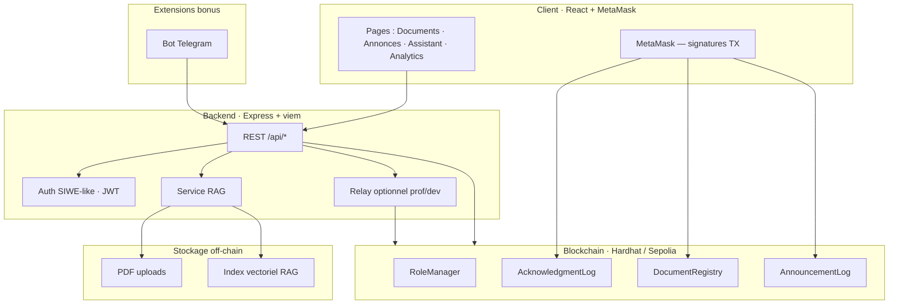

<div align="center">

# Decentralized Academic Assistant

**Plateforme académique décentralisée — traçabilité on-chain, assistant RAG et wallet MetaMask**

[](https://hardhat.org/)
[](https://react.dev/)
[](https://www.typescriptlang.org/)
[](https://soliditylang.org/)
[](docs/TESTING.md)

*Projet de fin de module — Blockchain S8 · UEMF / EIDIA*

[Démarrage rapide](#-démarrage-rapide) · [Architecture](#-architecture) · [Fonctionnalités](#-fonctionnalités) · [Sécurité](#-sécurité)

</div>

---

## Aperçu

Application full-stack pour la **gestion académique décentralisée** : enregistrement de documents (hash SHA-256), annonces vérifiables, accusés de réception signés par les étudiants via MetaMask, et assistant documentaire alimenté par un moteur **RAG** local.

<p align="center">
  
  <br />
  <em>Tableau de bord — rôles on-chain, documents et annonces</em>
</p>

---

## Architecture



| Couche | Technologies |
|--------|--------------|
| **Smart contracts** | Solidity 0.8.20, OpenZeppelin, Hardhat 3 |
| **Backend** | Node.js, Express, viem, JWT wallet-auth |
| **Frontend** | React 18, Vite, TypeScript, Tailwind CSS |
| **RAG** | Embeddings locaux, chunking PDF, recherche cosine |
| **Bonus** | Analytics on-chain, Slither, bot Telegram |

Documentation détaillée : [`docs/architecture.md`](docs/architecture.md)

---

## Fonctionnalités

| Domaine | MVP (énoncé) | Implémentation |
|---------|--------------|----------------|
| **Rôles** | ADMIN / PROF / ÉTUDIANT + groupes | `RoleManager` on-chain + JWT backend |
| **Documents** | Hash SHA-256, vérification intégrité | Upload PDF, `DocumentRegistry`, vérif client-side |
| **Annonces** | Publication hash-only par professeur | `AnnouncementLog` + métadonnées off-chain |
| **Accusés** | Signature étudiant MetaMask | `AcknowledgmentLog` — 1 ack par annonce |
| **Auth** | Connexion wallet | SIWE-like, sessions JWT |

### Extensions bonus (+5 chacune)

| # | Extension | Description |
|---|-----------|-------------|
| 1 | **Assistant RAG** | Questions/réponses sur PDF indexés, citations sources |
| 2 | **Analytics** | Statistiques lectures, annonces et accusés on-chain |
| 3 | **Slither** | Audit statique — **0 High, 0 Medium** |
| 4 | **Telegram** | Bot `/ask` connecté au backend RAG |

Matrice de tests : [`docs/TESTING.md`](docs/TESTING.md) · Script soutenance : [`docs/demo-script.md`](docs/demo-script.md)

---

## Démarrage rapide

**Prérequis :** Node.js 20+, MetaMask (chainId `31337`)

```powershell
# 1. Installer les dépendances
cd contracts; npm install; cd ..\backend; npm install; cd ..\frontend; npm install; cd ..

# 2. Lancer la blockchain + déployer (2 terminaux ou script auto)
cd contracts
npx hardhat node          # terminal 1
npm run deploy:local      # terminal 2
Copy-Item ..\backend\.env.localhost.template ..\backend\.env -Force
npm run grant-roles:local

# 3. Démarrer backend + frontend
cd ..\backend; npm run dev    # terminal 3
cd ..\frontend; npm run dev   # terminal 4
```

**Alternative semi-automatique** (Hardhat déjà lancé) :

```powershell
powershell -ExecutionPolicy Bypass -File .\scripts\start-dev.ps1
```

Ouvrir **http://localhost:5173** · API **http://localhost:4000**

Guide complet : [`docs/DEMARRAGE_RAPIDE.md`](docs/DEMARRAGE_RAPIDE.md)

---

## Stack technique

```
contracts/     Solidity — 4 contrats core + tests Hardhat
backend/       API REST Express, relay optionnel, service RAG
frontend/      SPA React + Vite, auth wallet, explorer TX
rag/           Pipeline ingestion PDF → embeddings → requêtes
telegram-bot/  Extension Telegram (bonus)
scripts/       start-dev, smoke-test, setup Telegram
```

---

## Sécurité

| Contrôle | Résultat |
|----------|----------|
| **Slither** (Trail of Bits) | 0 High · 0 Medium · 0 Low |
| **Modèle contrats** | Hash-only, pas de transfert de valeur, accès `RoleManager` |
| **Secrets** | `.env` exclus du dépôt — templates `.env.example` fournis |

```bash
cd contracts && npm run compile && npm run slither
```

Tests automatisés :

```bash
cd contracts && npm test
```

---

## Structure du dépôt

```
.
├── contracts/          Smart contracts, tests, déploiement local
├── backend/            API REST + services blockchain & RAG
├── frontend/           Interface React
├── rag/                Moteur RAG autonome
├── telegram-bot/       Bot Telegram (bonus)
├── scripts/            Outils de développement
└── docs/               Documentation technique
```

---

## Auteur

**SAAD KORCHI**  
Université Euro-Méditerranéenne de Fès (UEMF) — EIDIA  
Module Blockchain — Semestre 8

---

<div align="center">

*Dépôt public — code source uniquement. Rapport académique transmis séparément.*

MIT License · voir [`LICENSE`](LICENSE)

</div>
