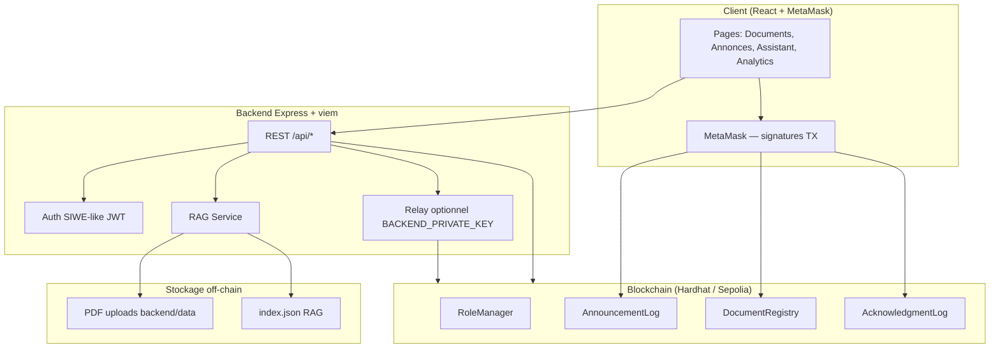

# Architecture — Decentralized Academic Assistant

Ce document correspond à la **Section 3** de l’énoncé (architecture MVP) et décrit l’implémentation réelle du dépôt.

## Vue d’ensemble

Application académique décentralisée : rôles on-chain, registre de documents (hash SHA-256), annonces (hash du contenu uniquement), accusés de réception étudiants, assistant RAG sur PDF.

**Écart documenté par rapport à l’énoncé HTML pur :** le frontend est **React + Vite + TypeScript + Tailwind** pour une UX moderne (routing, auth wallet, composants réutilisables). Les flux métier et endpoints API restent alignés sur l’énoncé ; voir le tableau de traçabilité dans le [README](../README.md).

## Diagramme (Mermaid)



## Diagramme ASCII (énoncé)

```
┌─────────────┐     JWT + REST      ┌──────────────┐     viem read/write    ┌─────────────────┐
│   React     │ ──────────────────► │   Express    │ ─────────────────────► │  Smart contracts │
│  + MetaMask │                       │   backend    │                        │ RoleManager      │
└──────┬──────┘                       └──────┬───────┘                        │ AnnouncementLog  │
       │                                     │                                │ DocumentRegistry │
       │ writeContract (étudiant ack)        │ relay optionnel (prof/dev)     │ AcknowledgmentLog│
       └─────────────────────────────────────┴────────────────────────────────►└─────────────────┘
                                              │
                                              ▼
                                    PDF + métadonnées JSON
                                    Index vectoriel RAG
```

## Contrats (Solidity)

| Contrat | Rôle |
|---------|------|
| `RoleManager` | ADMIN / PROFESSOR / STUDENT + groupes |
| `AnnouncementLog` | Publication hash-only par professeur |
| `DocumentRegistry` | Enregistrement hash PDF + `verifyDocument` |
| `AcknowledgmentLog` | Accusé réception étudiant (1× par annonce) |

Chemins : `contracts/contracts/core/*.sol`

## Backend

| Module | Chemin |
|--------|--------|
| Routes API | `backend/src/routes/` |
| Alias énoncé | `backend/src/routes/legacy.routes.ts` (`/api/announcement`, `/api/chat`, …) |
| Config publique chain | `backend/src/routes/config.routes.ts` |
| Services blockchain | `backend/src/services/blockchain/` |
| RAG | `backend/src/services/rag/` + package `rag/` |

## Frontend

| Fonctionnalité | Chemin |
|----------------|--------|
| Accusé MetaMask | `frontend/src/features/blockchain/onChain.ts` |
| Vérification PDF | `frontend/src/features/documents/DocumentVerifier.tsx` |
| Suivi professeur | `frontend/src/views/announcements/AnnouncementDetailPage.tsx` |
| Explorer liens | `frontend/src/lib/explorer.ts` |

## Extensions bonus (4)

1. **PDF Analysis (RAG)** — `rag/`, `backend/src/services/rag/`, page Assistant  
2. **Analytics Dashboard** — `backend/src/routes/analytics.routes.ts`, `frontend/src/views/analytics/`  
3. **Slither** — `contracts/slither.config.json`, `docs/security/slither-report.md`  
4. **Telegram Bot** — `telegram-bot/`

## Sécurité & confiance

- Contenu sensible **jamais** on-chain (seulement hashes).
- Auth : signature wallet + JWT court.
- Accusé étudiant : **transaction signée par l’étudiant** (flux par défaut UI).
- Relay backend : dev/demo uniquement si `BACKEND_PRIVATE_KEY` configuré.
- Bot Telegram : `BACKEND_SERVICE_TOKEN` + `BOT_SERVICE_WALLET_ADDRESS` (accès RAG sans JWT utilisateur).
